# Soulbound NFT (Attendance Badge) Minting Sequence

This diagram illustrates the complete flow of Soulbound Token (SBT) minting for attendance verification in the Ticketing Platform on Walrus.

## Sequence Diagram

```mermaid
sequenceDiagram
    autonumber
    actor Attendee
    participant Mobile as Mobile dApp
    participant Scanner as Gatekeeper Scanner
    participant SuiNetwork as Sui Blockchain
    participant Ticket as Ticket NFT Object
    participant Badge as AttendanceBadge (SBT)
    participant Profile as UserProfile
    participant Walrus as Walrus Storage
    
    %% Pre-Check-in State
    rect rgb(230, 240, 255)
    Note over Attendee,Mobile: Pre-Event: Ticket Ownership Verification
    Attendee->>+Mobile: Open Ticket
    Mobile->>Mobile: Generate Dynamic QR<br/>(TicketID + Address + Timestamp + Salt)
    Mobile-->>-Attendee: Display Rotating QR Code<br/>(30s refresh)
    end
    
    %% Check-in Process
    rect rgb(255, 240, 230)
    Note over Scanner,SuiNetwork: Venue Entry: Check-in Procedure
    Attendee->>+Scanner: Present QR Code
    Scanner->>Scanner: Extract Payload<br/>(TicketID, Address, Signature)
    Scanner->>+SuiNetwork: Verify Signature<br/>& Ticket Ownership
    SuiNetwork->>+Ticket: Check State<br/>(is_redeemed == false?)
    
    alt Ticket Already Redeemed
        Ticket-->>Scanner: Error: Already Checked In
        Scanner-->>Attendee: ❌ Entry Denied<br/>(Double-spend prevention)
    else Ticket Valid
        Ticket-->>-SuiNetwork: ✓ Valid & Unredeemed
        
        %% Atomic Transaction Block
        rect rgb(200, 255, 200)
        Note over SuiNetwork,Badge: Atomic PTB: Redemption + Badge Minting
        
        par Ticket Redemption
            SuiNetwork->>+Ticket: redeem_ticket()<br/>Set is_redeemed = true
            Ticket->>Ticket: Update State<br/>Capture Timestamp (0x6 Clock)
            Ticket->>SuiNetwork: Emit RedemptionEvent<br/>(TicketID, GateID, Timestamp)
            Ticket-->>-SuiNetwork: ✓ Redemption Complete
        and Badge Minting (Triggered)
            SuiNetwork->>+Badge: mint_attendance_badge()<br/>(Attendee Address)
            Badge->>Badge: Create SBT Object<br/>(NO store ability)
            Badge->>Badge: Set Metadata:<br/>- Event ID<br/>- Check-in Time<br/>- Entry Gate
            Badge->>Badge: Inject Dynamic Fields:<br/>"Early Bird" trait<br/>(if timestamp < threshold)
            Badge->>SuiNetwork: Emit BadgeMintedEvent<br/>(BadgeID, EventID, Timestamp)
            Badge-->>-SuiNetwork: ✓ Badge Created
        end
        
        SuiNetwork->>+Profile: Link Badge to Profile<br/>(UPS-02.3.1 Attendance History)
        Profile->>Profile: Append to attendance_log[]<br/>Update badge_count
        Profile-->>-SuiNetwork: ✓ Profile Updated
        
        SuiNetwork->>+Walrus: Store Badge Metadata<br/>(SVG Image, Traits)
        Walrus->>Walrus: Generate Blob ID
        Walrus-->>-SuiNetwork: Return blob_id
        
        SuiNetwork->>Badge: Update url field<br/>(Walrus Blob ID)
        end
        
        SuiNetwork-->>-Scanner: ✓ Transaction Finalized<br/>(sub-400ms)
        Scanner-->>-Attendee: ✅ Entry Granted<br/>Badge Received!
    end
    end
    
    %% Post-Check-in State
    rect rgb(240, 255, 240)
    Note over Attendee,Walrus: Post-Event: Badge Verification & Display
    Attendee->>+Mobile: View Wallet
    Mobile->>+SuiNetwork: Query AttendanceBadges<br/>(owner == Attendee)
    SuiNetwork->>+Badge: Fetch Badge Objects
    Badge-->>-SuiNetwork: Return Badge Metadata
    SuiNetwork-->>-Mobile: Badge List with Traits
    
    Mobile->>+Walrus: Fetch Badge SVG<br/>(using blob_id)
    Walrus-->>-Mobile: Return Badge Image
    Mobile-->>-Attendee: Display Badge Gallery<br/>(Non-transferable Proof)
    end
    
    %% Post-Redemption Content Access
    rect rgb(255, 250, 230)
    Note over Attendee,Walrus: Bonus: Redemption-Gated Content Access
    Attendee->>+Mobile: Access Exclusive Content
    Mobile->>+SuiNetwork: Request seal_approve_access()<br/>(verify is_redeemed == true)
    
    alt Ticket Not Redeemed
        SuiNetwork-->>Mobile: ❌ Access Denied<br/>(Must check in first)
        Mobile-->>Attendee: Content Locked<br/>(Requires Physical Attendance)
    else Ticket Redeemed
        SuiNetwork->>+Ticket: Verify Redemption State
        Ticket-->>-SuiNetwork: ✓ is_redeemed == true
        SuiNetwork->>SuiNetwork: Generate Seal Decryption Key
        SuiNetwork-->>-Mobile: ✓ Access Granted<br/>(Decryption Fragments)
        
        Mobile->>+Walrus: Fetch Encrypted Content<br/>(using blob_id)
        Walrus-->>-Mobile: Return Encrypted Blob
        Mobile->>Mobile: Decrypt Content<br/>(using Seal fragments)
        Mobile-->>Attendee: 🎁 Display Exclusive Content<br/>(Backstage, Recordings, etc.)
    end
    end
    
    %% Security & Invariants
    rect rgb(255, 230, 230)
    Note over Badge,Profile: SBT Security Guarantees
    Note over Badge: ⚠️ NON-TRANSFERABLE<br/>No store ability<br/>Transfer attempts fail
    Note over Badge: ✓ SOULBOUND<br/>Permanently linked to<br/>attendee address
    Note over Badge: ✓ VERIFIABLE<br/>On-chain proof of<br/>attendance history
    Note over Profile: ✓ PERMANENT<br/>Cannot be deleted<br/>or revoked by user
    end
```

## Key Components

### 1. **Ticket NFT Object**
- Mutable state: `is_redeemed` flag
- Redemption timestamp captured via Sui Clock (0x6)
- Emits `RedemptionEvent` for audit trail

### 2. **AttendanceBadge (SBT)**
- **Non-transferable**: Lacks `store` ability
- **Soulbound**: Permanently linked to attendee address
- **Dynamic Traits**: Early bird status, VIP access, etc.
- **Walrus Integration**: SVG badge images stored as blobs

### 3. **Atomic PTB (Programmable Transaction Block)**
- **Single Transaction**: Redemption + Badge minting are atomic
- **Fail-Safe**: Both operations succeed or both revert
- **Storage Rebate**: Optional ticket burn to fund badge minting

### 4. **Security Features**
- **Double-Spend Prevention**: Single-Writer object model
- **Timestamped Verification**: Immutable audit trail
- **Cryptographic Binding**: QR signature verification
- **Seal-Based Access**: Post-redemption content gating

## Domain Isomorphism Patterns

This flow reuses several patterns from existing platform infrastructure:

| Pattern | Source Domain | Ticketing Domain |
|---------|---------------|------------------|
| **Object Redemption** | Campaign completion → Milestone SBT | Ticket check-in → Attendance Badge |
| **State Mutation** | Donation status tracking | Ticket redemption flag |
| **Achievement Minting** | Threshold-based badges | Time-based attendance traits |
| **Capability Gating** | AdminCap for campaigns | ScannerCap for redemption |
| **Profile Integration** | Donor history tracking | Attendee attendance log |

## Technical Notes

- **Performance**: Sub-400ms finality via Sui's owned-object execution lane
- **Privacy**: Badge metadata can be encrypted for sensitive events
- **Scalability**: Parallel execution across multiple entry gates
- **Compliance**: Immutable audit trail for regulatory requirements
- **User Experience**: Instant wallet notification upon badge mint

## References

- **Implementation**: [AM-3.2.1 - Attendance Tracking](../requirements/mvp_01/03%20-%20Attendance_Management_AM-03.md)
- **SBT Standards**: [NFT-14.8 - Soulbound Token Standards](../requirements/mvp_01/06%20-%20NFT_Implementation_NFT-06.md)
- **Profile Integration**: [UPS-02.3.1 - Attendance History](../requirements/mvp_01/02%20-%20User_Profile_System_UPS-02.md)
- **Sealed Content**: [AM-3.4.3 - Gated Content](../requirements/mvp_01/03%20-%20Attendance_Management_AM-03.md)
